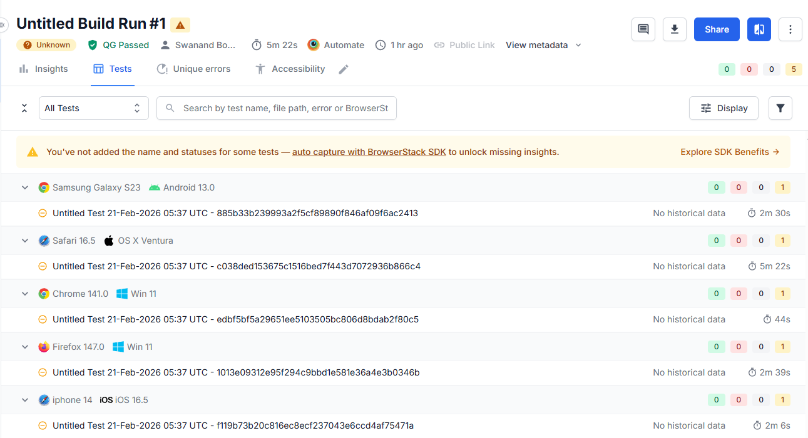

# BrowserStack CE Assignment – El País Opinion Scraper

## Overview

This project is a Python-based web scraping solution that extracts opinion articles from the Spanish newspaper **El País**.

The scraper collects article data, translates the titles into English, and performs a simple text analysis to identify repeated words across translated titles.

The project is designed with a **modular architecture** and demonstrates practical use of **Selenium automation, web scraping, translation APIs, and text processing**.

It also supports **cross-browser execution using BrowserStack Automate**.

---

## Features

- Scrapes the **Opinion section of El País**
- Extracts **title and content of the first 5 articles**
- Downloads the **cover image for each article**
- Translates Spanish titles into **English**
- Performs **word frequency analysis** on translated titles
- Runs locally using Selenium
- Supports **parallel execution using BrowserStack**

---

## Project Structure

browserstack-assignment
│
├── main.py
│
├── driver
│ └── driver_setup.py
│
├── scraper
│ ├── link_collector.py
│ └── article_scraper.py
│
├── utils
│ ├── translator.py
│ └── word_analysis.py
│
├── images
│ └── downloaded article images
│
├── screenshots
│ └── execution screenshots
│
├── requirements.txt
└── README.md


### Module Responsibilities

**driver**
- Handles browser setup and configuration.

**scraper**
- Collects article links.
- Extracts article content and images.

**utils**
- Translates article titles.
- Performs word frequency analysis.

**main.py**
- Coordinates the full scraping workflow.

---

## Architecture

El País Opinion Page
↓
Article Link Extraction
↓
Article Scraping (Title + Content + Image)
↓
Title Translation (Spanish → English)
↓
Text Processing
↓
Repeated Word Analysis


---

## Technologies Used

- **Python**
- **Selenium WebDriver**
- **BrowserStack Automate**
- **deep-translator**
- **Requests**
- **BeautifulSoup (for parsing if needed)**

---

## Setup Instructions

### 1. Install dependencies

```bash
pip install -r requirements.txt
```

### 2. Run locally
```bash
python main.py
```

The script will:

-Launch a Selenium browser session
-Navigate to El País Opinion section
-Extract the first 5 articles
-Download article images
-Translate article titles
-Perform repeated word analysis

### 3. Run on BrowserStack

Ensure BrowserStack credentials are configured.

Then run:

```bash
browserstack-sdk python main.py
```

This will execute the scraper using BrowserStack's cloud browsers.

### Example Output

Example console output:

```bash
SPANISH TITLE: La política europea en crisis
Translated: European politics in crisis

Repeated words:
politics 3
crisis 2
```

## Execution Proof

### Local Execution Output


### BrowserStack Parallel Run


Challenges & Considerations

-Handling dynamic page elements and cookie banners
-Ensuring stable Selenium waits using WebDriverWait
-Managing translation requests efficiently
-Extracting content from pages with varying HTML structures

Possible Improvements

-Add asynchronous scraping for faster execution
-Store results in a database instead of console output
-Add logging and monitoring
-Implement retry mechanisms for network failures
-Extend analysis to include NLP-based insights
