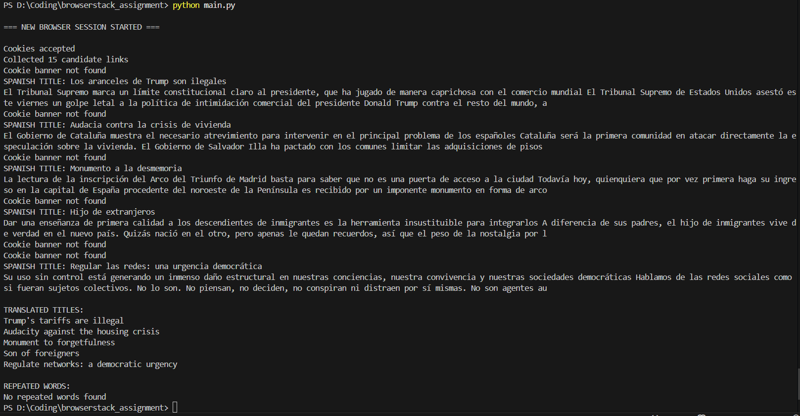

# BrowserStack Selenium Assignment

## Overview
This project performs:

- Selenium-based web scraping from El País (Opinion section)
- Extraction of first 5 articles in Spanish
- Translation of article titles to English
- Text analysis to find repeated words
- Cross-browser execution using BrowserStack parallel testing

---

## Tech Stack
- Python
- Selenium
- BrowserStack Automate
- deep-translator
- Requests

---

## How to Run

### Local
```bash
python main.py
```

### BrowserStack
```bash
browserstack-sdk python main.py
```

## Execution Proof

### Local Execution Output


### BrowserStack Parallel Run


